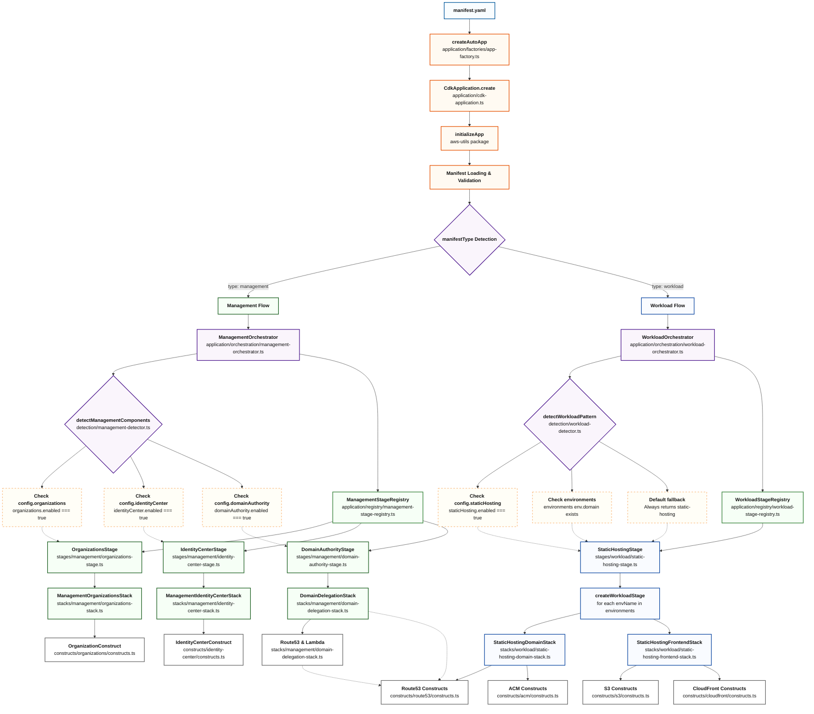

# @codeiqlabs/aws-cdk

The CodeIQLabs CDK follows a 5-layer architecture that automatically detects the infrastructure
pattern from your `manifest.yaml` file and creates the appropriate AWS resources with built-in
naming, tagging, and best practices.

## Key Features

- **Library-Provided Stacks**: Pre-built, reusable stack implementations for common infrastructure
  patterns
- **Declarative Stage Pattern**: Automatic stack creation with dependency resolution and conditional
  logic
- **Reusable Constructs**: Standardized constructs for AWS Organizations, Identity Center, and
  deployment permissions
- **Base Stack Classes**: Foundation classes for management and workload accounts with automatic
  tagging and naming
- **Type Safety**: Full TypeScript support with comprehensive type definitions and validation
- **Simplified Import Paths**: Clean, logical module organization for better developer experience
- **Dual Module Support**: Full ESM and CommonJS compatibility with modern tsup bundler



## Core Concepts

### 1. Manifest-Driven Infrastructure

Everything starts with a `manifest.yaml` file that describes your infrastructure requirements:

```yaml
# Management Account Example
type: "management"
project: "CodeIQLabs"
company: "CodeIQLabs"

# Workload Account Example
type: "workload"
project: "MyProject"
company: "MyCompany"
environments:
  nprd:
    accountId: "123456789012"
    config:
      domain:
        name: "staging.example.com"
```

### 2. Auto-Detection

The system automatically detects what type of infrastructure to create based on the manifest
content:

- **Management Type**: Creates organizational infrastructure
- **Workload Type**: Creates application hosting infrastructure

### 3. Two Core Patterns

#### Management Pattern

Creates foundational organizational infrastructure:

- **AWS Organizations** with OUs and member accounts
- **Identity Center SSO** with permission sets and assignments
- **Domain Authority** for cross-account DNS delegation

#### Workload Pattern

Creates static website hosting infrastructure:

- **S3 + CloudFront** for content delivery
- **Domain Consumer** for subdomain management
- **Environment-Specific** deployments (nprd/prod)

## Architecture Layers

### Layer 0: Foundation Layer (Core)

- **Base Constructs**: Foundation for all AWS resource constructs
- **Auto-Tagging**: Automatic tagging applied to all resources
- **Auto-Naming**: Consistent naming conventions across all resources
- **Best Practices**: Built-in security and compliance patterns

### Layer 1: Application Layer

**Application Factories:**

- **Factory Functions**: `application/factories/app-factory.ts` - Main entry points
  (`createAutoApp`, `createManagementApp`, `createWorkloadApp`)
- **Factory Utilities**: `application/factories/factory-utils.ts` - Shared factory patterns

**Stage Registries:**

- **Management Registry**: `application/registry/management-stage-registry.ts` - Component-based
  stage registration
- **Workload Registry**: `application/registry/workload-stage-registry.ts` - Pattern-based stage
  registration
- **Registry Types**: `application/registry/stage-registry-types.ts` - Shared type definitions

**Stage Orchestration:**

- **Management Orchestrator**: `application/orchestration/management-orchestrator.ts` - Management
  stage creation logic
- **Workload Orchestrator**: `application/orchestration/workload-orchestrator.ts` - Workload stage
  creation logic
- **Base Orchestrator**: `application/orchestration/base-orchestrator.ts` - Shared orchestration
  patterns

**Configuration Management:**

- **App Configuration**: `application/config/app-config.ts` - Application-level configuration and
  validation
- **Factory Options**: `application/config/factory-options.ts` - Factory function option types and
  defaults

**Core Application:**

- **CDK Application**: `application/cdk-application.ts` - CDK application class with manifest
  loading

### Layer 2: Stage Layer (Orchestration)

- **Base Stages**: Provide common functionality and utilities
- **Standard Stages**: Implement specific patterns for each use case
- **Inheritance**: Standard stages extend base stages

### Layer 3: Stack Layer (Infrastructure Groups)

- **Management Stacks**: Organizations, Identity Center, Domain Delegation
- **Workload Stacks**: Static Hosting Domain, Static Hosting Frontend
- **Base Stacks**: Common stack functionality

### Layer 4: AWS Service Constructs (Reusable Components)

- **Individual AWS Services**: S3, CloudFront, Route53, ACM, Organizations, Identity Center
- **Built-in Patterns**: Each construct includes naming, tagging, and best practices
- **Maximum Reusability**: Can be composed by any stack for different use cases

## Usage

### Simple Auto-Detection Approach

```typescript
import { createAutoApp } from '@codeiqlabs/aws-cdk';

// Automatically detects type from manifest.yaml
createAutoApp().then((app) => app.synth());
```

### Type-Specific Approach

```typescript
import { createManagementApp, createWorkloadApp } from '@codeiqlabs/aws-cdk';

// Management account
createManagementApp().then((app) => app.synth());

// Workload account
createWorkloadApp().then((app) => app.synth());
```

### Advanced Usage with Direct Module Access

```typescript
// Direct factory access
import { createAutoApp } from '@codeiqlabs/aws-cdk/application/factories';

// Registry access for custom stage registration
import {
  ManagementStageRegistry,
  WorkloadStageRegistry,
} from '@codeiqlabs/aws-cdk/application/registry';

// Orchestrator access for custom orchestration
import {
  ManagementOrchestrator,
  WorkloadOrchestrator,
} from '@codeiqlabs/aws-cdk/application/orchestration';
```

## Installation

```bash
# Using npm
npm install @codeiqlabs/aws-cdk

# Using yarn
yarn add @codeiqlabs/aws-cdk

# Using pnpm
pnpm add @codeiqlabs/aws-cdk
```

### Peer Dependencies

```bash
# Required peer dependencies
npm install aws-cdk-lib constructs @codeiqlabs/aws-utils
```

## Core File List

### Layer 0: Foundation Layer (Core)

Core constructs with automatic naming and tagging patterns.

- `src/core/constructs/tagged-construct.ts` - Auto-tagging construct
- `src/core/constructs/named-construct.ts` - Auto-naming construct

### Layer 1: Application Layer

Auto-detection and application bootstrap functionality with modular architecture.

**Application Factories:**

- `src/application/factories/app-factory.ts` - Main factory functions (`createAutoApp`,
  `createManagementApp`, `createWorkloadApp`)
- `src/application/factories/factory-utils.ts` - Shared factory utilities

**Stage Registries:**

- `src/application/registry/management-stage-registry.ts` - Component-based stage registration and
  lookup
- `src/application/registry/workload-stage-registry.ts` - Pattern-based stage registration and
  lookup
- `src/application/registry/stage-registry-types.ts` - Shared registry type definitions

**Stage Orchestration:**

- `src/application/orchestration/management-orchestrator.ts` - Management stage creation logic
- `src/application/orchestration/workload-orchestrator.ts` - Workload stage creation logic
- `src/application/orchestration/base-orchestrator.ts` - Shared orchestration patterns

**Configuration Management:**

- `src/application/config/app-config.ts` - Application-level configuration and validation
- `src/application/config/factory-options.ts` - Factory function option types and defaults

**Core Application:**

- `src/application/cdk-application.ts` - CDK application class with manifest loading

### Layer 2: Stage Layer (Orchestration)

High-level orchestration of infrastructure deployment with pattern-specific stages.

**Base Stages (Foundation):**

- `src/stages/base/management-base-stage.ts` - Base management stage with common functionality
- `src/stages/base/workload-base-stage.ts` - Base workload stage with common functionality

**Management Stages (Pattern-Specific):**

- `src/stages/management/organizations-stage.ts` - AWS Organizations infrastructure stage
- `src/stages/management/identity-center-stage.ts` - Identity Center SSO infrastructure stage
- `src/stages/management/domain-authority-stage.ts` - Domain authority and delegation stage

**Workload Stages (Pattern-Specific):**

- `src/stages/workload/static-hosting-stage.ts` - Static website hosting (S3 + CloudFront)

### Layer 3: Stack Layer (Infrastructure Groups)

Reusable stack classes that group related infrastructure components.

**Base Stack Classes:**

- `src/stacks/base/management-base.ts` - Base management stack functionality
- `src/stacks/base/workload-base.ts` - Base workload stack functionality

**Management Account Stacks:**

- `src/stacks/management/organizations-stack.ts` - AWS Organizations infrastructure
- `src/stacks/management/identity-center-stack.ts` - Identity Center SSO infrastructure
- `src/stacks/management/domain-delegation-stack.ts` - Domain Authority infrastructure

**Workload Account Stacks:**

- `src/stacks/workload/static-hosting-domain-stack.ts` - Domain Consumer infrastructure
- `src/stacks/workload/static-hosting-frontend-stack.ts` - S3 + CloudFront infrastructure

### Layer 4: AWS Service Constructs (Reusable Components)

Individual AWS service constructs with built-in naming, tagging, and best practices.

**Static Hosting Service Constructs:**

- `src/constructs/s3/constructs.ts` - S3 bucket constructs with naming/tagging
- `src/constructs/cloudfront/constructs.ts` - CloudFront distribution constructs
- `src/constructs/route53/constructs.ts` - Route53 hosted zone, records constructs
- `src/constructs/acm/constructs.ts` - SSL Certificate constructs

**Management Service Constructs:**

- `src/constructs/organizations/constructs.ts` - Organizations constructs (OUs, Accounts, SCPs)
- `src/constructs/identity-center/constructs.ts` - Identity Center constructs (Permission Sets,
  Assignments)

### Detection Logic

Auto-detection utilities for determining infrastructure patterns.

- `src/detection/workload-detector.ts` - Workload pattern detection logic
- `src/detection/management-detector.ts` - Management component detection logic

### Package Root

- `src/index.ts` - Main package exports (entry point)

## Architecture Summary

### Core Infrastructure Patterns

**Management Account Infrastructure:**

- **OrganizationsStage** - AWS Organizations with OUs and accounts
- **IdentityCenterStage** - Identity Center SSO with permission sets
- **DomainAuthorityStage** - Domain authority and cross-account delegation

**Static Website Infrastructure:**

- **StaticHostingStage** - S3 + CloudFront hosting with custom domains

## Auto-Detection Flow

The architecture uses pattern detection to automatically select the appropriate infrastructure:

### 1. Pattern Detection

```typescript
// src/detection/workload-detector.ts
function detectWorkloadPattern(config: WorkloadAppConfig): 'static-hosting' {
  // Currently supports static hosting pattern
  return 'static-hosting';
}

// src/detection/management-detector.ts
function detectManagementComponents(config: ManagementAppConfig): string[] {
  const components = [];
  if (config.organizations) components.push('organizations');
  if (config.identityCenter) components.push('identityCenter');
  if (config.domain) components.push('domainAuthority');
  return components;
}
```

### 2. Modular Application Architecture

**Factory Implementation:**

```typescript
// src/application/factories/app-factory.ts
export async function createAutoApp(options: CdkApplicationOptions = {}): Promise<CdkApplication> {
  const app = await CdkApplication.create(options);

  switch (app.manifestType) {
    case 'management':
      const managementOrchestrator = new ManagementOrchestrator();
      managementOrchestrator.createStages(app);
      break;
    case 'workload':
      const workloadOrchestrator = new WorkloadOrchestrator();
      workloadOrchestrator.createStages(app);
      break;
  }

  return app;
}
```

**Management Orchestrator:**

```typescript
// src/application/orchestration/management-orchestrator.ts
export class ManagementOrchestrator {
  private registry = new ManagementStageRegistry();

  createStages(app: CdkApplication): void {
    const managementConfig = app.config as ManagementConfig;
    const components = detectManagementComponents(managementConfig);

    for (const component of components) {
      const stageClass = this.registry.getStage(component);
      if (stageClass) {
        app.createManagementStage(stageClass);
      }
    }
  }
}
```

**Workload Orchestrator:**

```typescript
// src/application/orchestration/workload-orchestrator.ts
export class WorkloadOrchestrator {
  private registry = new WorkloadStageRegistry();

  createStages(app: CdkApplication): void {
    const workloadConfig = app.config as WorkloadConfig;
    const pattern = detectWorkloadPattern(workloadConfig);

    const stageClass = this.registry.getStage(pattern);
    if (stageClass) {
      for (const [envName] of Object.entries(workloadConfig.environments)) {
        app.createWorkloadStage(envName, stageClass);
      }
    }
  }
}
```

**Stage Registry Examples:**

```typescript
// src/application/registry/management-stage-registry.ts
export class ManagementStageRegistry {
  private stages = new Map<string, ManagementStageConstructor>();

  constructor() {
    // Register default management stages
    this.registerStage('organizations', OrganizationsStage);
    this.registerStage('identityCenter', IdentityCenterStage);
    this.registerStage('domainAuthority', DomainAuthorityStage);
  }

  registerStage(component: string, stageClass: ManagementStageConstructor): void {
    this.stages.set(component, stageClass);
  }

  getStage(component: string): ManagementStageConstructor | undefined {
    return this.stages.get(component);
  }
}

// src/application/registry/workload-stage-registry.ts
export class WorkloadStageRegistry {
  private stages = new Map<string, WorkloadStageConstructor>();

  constructor() {
    // Register default workload stages
    this.registerStage('static-hosting', StaticHostingStage);
  }

  registerStage(pattern: string, stageClass: WorkloadStageConstructor): void {
    this.stages.set(pattern, stageClass);
  }

  getStage(pattern: string): WorkloadStageConstructor | undefined {
    return this.stages.get(pattern);
  }
}
```

## Example Manifest Structures

### Management Account Pattern

```yaml
type: management
project: CodeIQLabs
organizations:
  enabled: true
  organizationalUnits:
    - name: Production
    - name: NonProduction
identityCenter:
  enabled: true
  permissionSets:
    - name: AdminAccess
    - name: ReadOnlyAccess
domain:
  name: codeiqlabs.com
  hostedZoneId: Z123456789
```

**Creates**: `OrganizationsStage` + `IdentityCenterStage` + `DomainAuthorityStage`

### Static Hosting Pattern

```yaml
type: workload
project: MyApp
domain:
  name: myapp.example.com
staticHosting:
  spa: true
  errorDocument: index.html
environments:
  production:
    account: '123456789012'
    region: us-east-1
```

**Creates**: `StaticHostingStage` for production environment

---

**Part of the CodeIQLabs infrastructure ecosystem** - Accelerating AWS CDK development with
reusable, standardized constructs and patterns.

MIT - See [LICENSE](LICENSE) file for details.
