# File Structure Reference

This document provides a reference of the core TypeScript files in the `@codeiqlabs/aws-cdk` package
needed for the essential infrastructure patterns.

## File Structure Diagram

Visual overview of the modular architecture organized by layers:

```mermaid
%%{init: {"securityLevel": "loose"}}%%
graph TD
  %% Layer 0: Foundation Layer (Core)
  A[<b>Layer 0: Foundation Layer</b><br/>Core constructs with automatic patterns]
  A --> A1[<b>TaggedConstruct</b><br/>src/core/constructs/tagged-construct.ts]
  A --> A2[<b>NamedConstruct</b><br/>src/core/constructs/named-construct.ts]

  %% Layer 1: Application Layer
  B[<b>Layer 1: Application Layer</b><br/>Auto-detection and bootstrap functionality]

  %% Application Factories
  B --> B1[<b>Application Factories</b>]
  B1 --> B11[<b>createAutoApp</b><br/>src/application/factories/app-factory.ts]
  B1 --> B12[<b>Factory Utilities</b><br/>src/application/factories/factory-utils.ts]

  %% Stage Registries
  B --> B2[<b>Stage Registries</b>]
  B2 --> B21[<b>ManagementStageRegistry</b><br/>src/application/registry/management-stage-registry.ts]
  B2 --> B22[<b>WorkloadStageRegistry</b><br/>src/application/registry/workload-stage-registry.ts]
  B2 --> B23[<b>Registry Types</b><br/>src/application/registry/stage-registry-types.ts]

  %% Stage Orchestration
  B --> B3[<b>Stage Orchestration</b>]
  B3 --> B31[<b>ManagementOrchestrator</b><br/>src/application/orchestration/management-orchestrator.ts]
  B3 --> B32[<b>WorkloadOrchestrator</b><br/>src/application/orchestration/workload-orchestrator.ts]
  B3 --> B33[<b>BaseOrchestrator</b><br/>src/application/orchestration/base-orchestrator.ts]

  %% Configuration Management
  B --> B4[<b>Configuration Management</b>]
  B4 --> B41[<b>App Config</b><br/>src/application/config/app-config.ts]
  B4 --> B42[<b>Factory Options</b><br/>src/application/config/factory-options.ts]

  %% Core Application
  B --> B5[<b>Core Application</b>]
  B5 --> B51[<b>CdkApplication</b><br/>src/application/cdk-application.ts]

  %% Layer 2: Stage Layer
  C[<b>Layer 2: Stage Layer</b><br/>Pattern-specific orchestration]

  %% Base Stages
  C --> C1[<b>Base Stages</b>]
  C1 --> C11[<b>ManagementBaseStage</b><br/>src/stages/base/management-base-stage.ts]
  C1 --> C12[<b>WorkloadBaseStage</b><br/>src/stages/base/workload-base-stage.ts]

  %% Management Stages
  C --> C2[<b>Management Stages</b>]
  C2 --> C21[<b>OrganizationsStage</b><br/>src/stages/management/organizations-stage.ts]
  C2 --> C22[<b>IdentityCenterStage</b><br/>src/stages/management/identity-center-stage.ts]
  C2 --> C23[<b>DomainAuthorityStage</b><br/>src/stages/management/domain-authority-stage.ts]

  %% Workload Stages
  C --> C3[<b>Workload Stages</b>]
  C3 --> C31[<b>StaticHostingStage</b><br/>src/stages/workload/static-hosting-stage.ts]

  %% Layer 3: Stack Layer
  D[<b>Layer 3: Stack Layer</b><br/>Infrastructure groups]

  %% Base Stacks
  D --> D1[<b>Base Stacks</b>]
  D1 --> D11[<b>ManagementBase</b><br/>src/stacks/base/management-base.ts]
  D1 --> D12[<b>WorkloadBase</b><br/>src/stacks/base/workload-base.ts]

  %% Management Stacks
  D --> D2[<b>Management Stacks</b>]
  D2 --> D21[<b>OrganizationsStack</b><br/>src/stacks/management/organizations-stack.ts]
  D2 --> D22[<b>IdentityCenterStack</b><br/>src/stacks/management/identity-center-stack.ts]
  D2 --> D23[<b>DomainDelegationStack</b><br/>src/stacks/management/domain-delegation-stack.ts]

  %% Workload Stacks
  D --> D3[<b>Workload Stacks</b>]
  D3 --> D31[<b>StaticHostingDomainStack</b><br/>src/stacks/workload/static-hosting-domain-stack.ts]
  D3 --> D32[<b>StaticHostingFrontendStack</b><br/>src/stacks/workload/static-hosting-frontend-stack.ts]

  %% Layer 4: Construct Layer
  E[<b>Layer 4: AWS Service Constructs</b><br/>Reusable components]

  %% Static Hosting Constructs
  E --> E1[<b>Static Hosting Constructs</b>]
  E1 --> E11[<b>S3 Constructs</b><br/>src/constructs/s3/constructs.ts]
  E1 --> E12[<b>CloudFront Constructs</b><br/>src/constructs/cloudfront/constructs.ts]
  E1 --> E13[<b>Route53 Constructs</b><br/>src/constructs/route53/constructs.ts]
  E1 --> E14[<b>ACM Constructs</b><br/>src/constructs/acm/constructs.ts]

  %% Management Constructs
  E --> E2[<b>Management Constructs</b>]
  E2 --> E21[<b>Organizations Constructs</b><br/>src/constructs/organizations/constructs.ts]
  E2 --> E22[<b>Identity Center Constructs</b><br/>src/constructs/identity-center/constructs.ts]

  %% Layer Dependencies (showing flow)
  A -.-> B
  B -.-> C
  C -.-> D
  D -.-> E

  %% Styles - matching the reference diagram
  classDef layer fill:#f9fdff,stroke:#01579b,stroke-width:3px,color:#111
  classDef core fill:#ffffff,stroke:#666666,stroke-width:2px,color:#111
  classDef factory fill:#fffaf2,stroke:#e65100,stroke-width:2px,color:#111
  classDef orchestration fill:#faf5fc,stroke:#4a148c,stroke-width:2px,color:#111
  classDef registry fill:#f6fff6,stroke:#2e7d32,stroke-width:2px,color:#111
  classDef config fill:#fffef7,stroke:#f57f17,stroke-width:2px,color:#111
  classDef stages fill:#f6fff6,stroke:#1b5e20,stroke-width:2px,color:#111
  classDef stacks fill:#fff9fb,stroke:#880e4f,stroke-width:2px,color:#111
  classDef constructs fill:#ffffff,stroke:#666666,stroke-width:2px,color:#111
  classDef groups fill:#f5f5f5,stroke:#424242,stroke-width:2px,color:#111

  %% Layer headers
  class A,B,C,D,E layer
  %% Layer 0 - Core
  class A1,A2 core
  %% Layer 1 - Application
  class B1,B2,B3,B4,B5 groups
  class B11,B12 factory
  class B21,B22,B23 registry
  class B31,B32,B33 orchestration
  class B41,B42 config
  class B51 factory
  %% Layer 2 - Stages
  class C1,C2,C3 groups
  class C11,C12,C21,C22,C23,C31 stages
  %% Layer 3 - Stacks
  class D1,D2,D3 groups
  class D11,D12,D21,D22,D23,D31,D32 stacks
  %% Layer 4 - Constructs
  class E1,E2 groups
  class E11,E12,E13,E14,E21,E22 constructs


```



## Core File List

### Layer 0: Foundation Layer (Core)

Core constructs with automatic naming and tagging patterns.

- `src/core/constructs/tagged-construct.ts` - Auto-tagging construct
- `src/core/constructs/named-construct.ts` - Auto-naming construct

### Layer 1: Application Layer

Auto-detection and application bootstrap functionality with modular architecture.

**Application Factories:**

- `src/application/factories/app-factory.ts` - Main factory functions (`createAutoApp`,
  `createManagementApp`, `createWorkloadApp`)
- `src/application/factories/factory-utils.ts` - Shared factory utilities

**Stage Registries:**

- `src/application/registry/management-stage-registry.ts` - Component-based stage registration and
  lookup
- `src/application/registry/workload-stage-registry.ts` - Pattern-based stage registration and
  lookup
- `src/application/registry/stage-registry-types.ts` - Shared registry type definitions

**Stage Orchestration:**

- `src/application/orchestration/management-orchestrator.ts` - Management stage creation logic
- `src/application/orchestration/workload-orchestrator.ts` - Workload stage creation logic
- `src/application/orchestration/base-orchestrator.ts` - Shared orchestration patterns

**Configuration Management:**

- `src/application/config/app-config.ts` - Application-level configuration and validation
- `src/application/config/factory-options.ts` - Factory function option types and defaults

**Core Application:**

- `src/application/cdk-application.ts` - CDK application class with manifest loading

### Layer 2: Stage Layer (Orchestration)

High-level orchestration of infrastructure deployment with pattern-specific stages.

**Base Stages (Foundation):**

- `src/stages/base/management-base-stage.ts` - Base management stage with common functionality
- `src/stages/base/workload-base-stage.ts` - Base workload stage with common functionality

**Management Stages (Pattern-Specific):**

- `src/stages/management/organizations-stage.ts` - AWS Organizations infrastructure stage
- `src/stages/management/identity-center-stage.ts` - Identity Center SSO infrastructure stage
- `src/stages/management/domain-authority-stage.ts` - Domain authority and delegation stage

**Workload Stages (Pattern-Specific):**

- `src/stages/workload/static-hosting-stage.ts` - Static website hosting (S3 + CloudFront)

### Layer 3: Stack Layer (Infrastructure Groups)

Reusable stack classes that group related infrastructure components.

**Base Stack Classes:**

- `src/stacks/base/management-base.ts` - Base management stack functionality
- `src/stacks/base/workload-base.ts` - Base workload stack functionality

**Management Account Stacks:**

- `src/stacks/management/organizations-stack.ts` - AWS Organizations infrastructure
- `src/stacks/management/identity-center-stack.ts` - Identity Center SSO infrastructure
- `src/stacks/management/domain-delegation-stack.ts` - Domain Authority infrastructure

**Workload Account Stacks:**

- `src/stacks/workload/static-hosting-domain-stack.ts` - Domain Consumer infrastructure
- `src/stacks/workload/static-hosting-frontend-stack.ts` - S3 + CloudFront infrastructure

### Layer 4: AWS Service Constructs (Reusable Components)

Individual AWS service constructs with built-in naming, tagging, and best practices.

**Static Hosting Service Constructs:**

- `src/constructs/s3/constructs.ts` - S3 bucket constructs with naming/tagging
- `src/constructs/cloudfront/constructs.ts` - CloudFront distribution constructs
- `src/constructs/route53/constructs.ts` - Route53 hosted zone, records constructs
- `src/constructs/acm/constructs.ts` - SSL Certificate constructs

**Management Service Constructs:**

- `src/constructs/organizations/constructs.ts` - Organizations constructs (OUs, Accounts, SCPs)
- `src/constructs/identity-center/constructs.ts` - Identity Center constructs (Permission Sets,
  Assignments)

### Detection Logic

Auto-detection utilities for determining infrastructure patterns.

- `src/detection/workload-detector.ts` - Workload pattern detection logic
- `src/detection/management-detector.ts` - Management component detection logic

### Package Root

- `src/index.ts` - Main package exports (entry point)

## Architecture Summary

### Core Infrastructure Patterns

**Management Account Infrastructure:**

- **OrganizationsStage** - AWS Organizations with OUs and accounts
- **IdentityCenterStage** - Identity Center SSO with permission sets
- **DomainAuthorityStage** - Domain authority and cross-account delegation

**Static Website Infrastructure:**

- **StaticHostingStage** - S3 + CloudFront hosting with custom domains

## Auto-Detection Flow

The architecture uses pattern detection to automatically select the appropriate infrastructure:

### 1. Pattern Detection

```typescript
// src/detection/workload-detector.ts
function detectWorkloadPattern(config: WorkloadAppConfig): 'static-hosting' {
  // Currently supports static hosting pattern
  return 'static-hosting';
}

// src/detection/management-detector.ts
function detectManagementComponents(config: ManagementAppConfig): string[] {
  const components = [];
  if (config.organizations) components.push('organizations');
  if (config.identityCenter) components.push('identityCenter');
  if (config.domain) components.push('domainAuthority');
  return components;
}
```

### 2. Modular Application Architecture

**Factory Implementation:**

```typescript
// src/application/factories/app-factory.ts
export async function createAutoApp(options: CdkApplicationOptions = {}): Promise<CdkApplication> {
  const app = await CdkApplication.create(options);

  switch (app.manifestType) {
    case 'management':
      const managementOrchestrator = new ManagementOrchestrator();
      managementOrchestrator.createStages(app);
      break;
    case 'workload':
      const workloadOrchestrator = new WorkloadOrchestrator();
      workloadOrchestrator.createStages(app);
      break;
  }

  return app;
}
```

**Management Orchestrator:**

```typescript
// src/application/orchestration/management-orchestrator.ts
export class ManagementOrchestrator {
  private registry = new ManagementStageRegistry();

  createStages(app: CdkApplication): void {
    const managementConfig = app.config as ManagementConfig;
    const components = detectManagementComponents(managementConfig);

    for (const component of components) {
      const stageClass = this.registry.getStage(component);
      if (stageClass) {
        app.createManagementStage(stageClass);
      }
    }
  }
}
```

**Workload Orchestrator:**

```typescript
// src/application/orchestration/workload-orchestrator.ts
export class WorkloadOrchestrator {
  private registry = new WorkloadStageRegistry();

  createStages(app: CdkApplication): void {
    const workloadConfig = app.config as WorkloadConfig;
    const pattern = detectWorkloadPattern(workloadConfig);

    const stageClass = this.registry.getStage(pattern);
    if (stageClass) {
      for (const [envName] of Object.entries(workloadConfig.environments)) {
        app.createWorkloadStage(envName, stageClass);
      }
    }
  }
}
```

**Stage Registry Examples:**

```typescript
// src/application/registry/management-stage-registry.ts
export class ManagementStageRegistry {
  private stages = new Map<string, ManagementStageConstructor>();

  constructor() {
    // Register default management stages
    this.registerStage('organizations', OrganizationsStage);
    this.registerStage('identityCenter', IdentityCenterStage);
    this.registerStage('domainAuthority', DomainAuthorityStage);
  }

  registerStage(component: string, stageClass: ManagementStageConstructor): void {
    this.stages.set(component, stageClass);
  }

  getStage(component: string): ManagementStageConstructor | undefined {
    return this.stages.get(component);
  }
}

// src/application/registry/workload-stage-registry.ts
export class WorkloadStageRegistry {
  private stages = new Map<string, WorkloadStageConstructor>();

  constructor() {
    // Register default workload stages
    this.registerStage('static-hosting', StaticHostingStage);
  }

  registerStage(pattern: string, stageClass: WorkloadStageConstructor): void {
    this.stages.set(pattern, stageClass);
  }

  getStage(pattern: string): WorkloadStageConstructor | undefined {
    return this.stages.get(pattern);
  }
}
```

## Example Manifest Structures

### Management Account Pattern

```yaml
type: management
project: CodeIQLabs
organizations:
  enabled: true
  organizationalUnits:
    - name: Production
    - name: NonProduction
identityCenter:
  enabled: true
  permissionSets:
    - name: AdminAccess
    - name: ReadOnlyAccess
domain:
  name: codeiqlabs.com
  hostedZoneId: Z123456789
```

**Creates**: `OrganizationsStage` + `IdentityCenterStage` + `DomainAuthorityStage`

### Static Hosting Pattern

```yaml
type: workload
project: MyApp
domain:
  name: myapp.example.com
staticHosting:
  spa: true
  errorDocument: index.html
environments:
  production:
    account: '123456789012'
    region: us-east-1
```

**Creates**: `StaticHostingStage` for production environment

## Modular Architecture Benefits

### Separation of Concerns

- **Factories**: Handle high-level application creation with clean public APIs
- **Registries**: Manage stage class registration and lookup with type safety
- **Orchestrators**: Coordinate between detection logic and stage creation
- **Configuration**: Centralize application-level configuration and validation

### Type Safety

- **Split Registries**: Management and workload stages use separate, type-safe registries
- **Dedicated Orchestrators**: Each manifest type has its own orchestrator with specific types
- **Clear Interfaces**: Well-defined interfaces between all components

### Extensibility

- **Plugin Architecture**: New stages can be registered without modifying core files
- **Pattern Independence**: Management components and workload patterns evolve independently
- **Future-Ready**: Architecture supports dynamic stage loading and external plugins

### Testability

- **Unit Testing**: Each module can be tested in isolation with clear dependencies
- **Mocking**: Orchestrators can be tested with mocked registries and detectors
- **Integration Testing**: Clean interfaces enable comprehensive integration testing

## Benefits of Focused Architecture

1. **Minimal Complexity**: Only the files needed for core patterns
2. **Clear Purpose**: Each stage has a specific, well-defined role
3. **Easy to Understand**: Straightforward mapping from manifest to infrastructure
4. **Extensible Foundation**: Easy to add new patterns when needed
5. **Production Ready**: Covers the essential infrastructure patterns for most use cases
6. **Modular Design**: Clean separation of concerns with focused, testable modules

## File Statistics

- **Total TypeScript Files**: ~55 files
- **Core Architecture Files**: ~47 files (85%)
- **Utility Files**: ~8 files (15%)
- **Files per Layer**:
  - Layer 0 (Foundation): 2 files
  - Layer 1 (Application): 14 files (modular architecture)
    - Factories: 2 files
    - Registries: 3 files
    - Orchestration: 3 files
    - Configuration: 2 files
    - Core Application: 1 file
    - Types & Index: 3 files
  - Layer 2 (Stages): 8 files
  - Layer 3 (Stacks): 12 files
  - Layer 4 (Constructs): 18 files
  - Detection Logic: 2 files
  - Common: 1 file

## Design Principles

1. **Manifest-Driven**: All configuration comes from manifest.yaml
2. **5-Layer Architecture**: Clear separation between foundation, application, stage, stack, and
   construct layers
3. **Foundation Layer**: Core constructs provide automatic naming, tagging, and best practices
4. **Inheritance**: Base classes provide common functionality, standard classes implement patterns
5. **Service-Oriented Constructs**: Individual AWS service constructs for maximum reusability
6. **Type Safety**: Full TypeScript support with proper type definitions at every layer
7. **Standardization**: Consistent naming, tagging, and patterns across all AWS resources

This file structure supports the two core use cases:

- **Management Pattern**: Organizational infrastructure (AWS Organizations, Identity Center, Domain
  Authority)
- **Workload Pattern**: Static hosting infrastructure (S3, CloudFront, Route53, ACM)

## Import Examples

```typescript
// Layer 0 - Foundation
import { TaggedConstruct, NamedConstruct } from '@codeiqlabs/aws-cdk/core';

// Layer 1 - Application (Modular)
// Main entry points
import { createAutoApp, createManagementApp, createWorkloadApp } from '@codeiqlabs/aws-cdk';

// Direct module access
import { createAutoApp } from '@codeiqlabs/aws-cdk/application/factories';
import {
  ManagementStageRegistry,
  WorkloadStageRegistry,
} from '@codeiqlabs/aws-cdk/application/registry';
import {
  ManagementOrchestrator,
  WorkloadOrchestrator,
} from '@codeiqlabs/aws-cdk/application/orchestration';
import { AppConfig } from '@codeiqlabs/aws-cdk/application/config';

// Layer 2 - Stages
import { ManagementBaseStage, WorkloadBaseStage } from '@codeiqlabs/aws-cdk/stages/base';
import { OrganizationsStage, IdentityCenterStage } from '@codeiqlabs/aws-cdk/stages/management';
import { StaticHostingStage } from '@codeiqlabs/aws-cdk/stages/workload';

// Layer 3 - Stacks
import { ManagementOrganizationsStack } from '@codeiqlabs/aws-cdk/stacks/management';
import { StaticHostingDomainStack } from '@codeiqlabs/aws-cdk/stacks/workload';

// Layer 4 - AWS Service Constructs
import { S3BucketConstruct } from '@codeiqlabs/aws-cdk/constructs/s3';
import { CloudFrontDistributionConstruct } from '@codeiqlabs/aws-cdk/constructs/cloudfront';
import { Route53HostedZoneConstruct } from '@codeiqlabs/aws-cdk/constructs/route53';
import { OrganizationsConstruct } from '@codeiqlabs/aws-cdk/constructs/organizations';

// Detection Logic
import { detectManagementComponents } from '@codeiqlabs/aws-cdk/detection/management-detector';
import { detectWorkloadPattern } from '@codeiqlabs/aws-cdk/detection/workload-detector';
```
