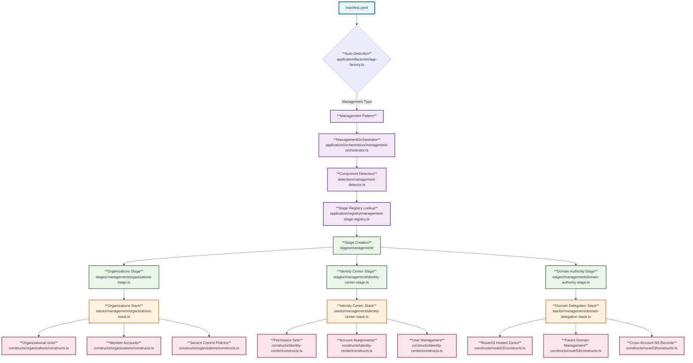
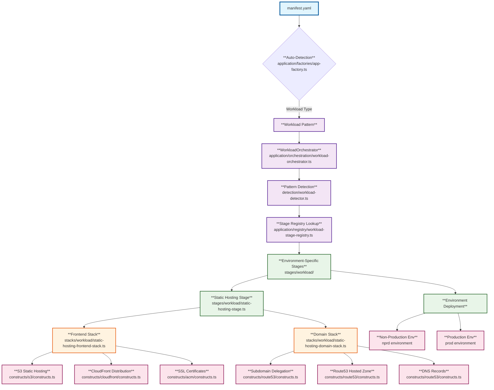

# Supported Infrastructure Patterns

This document describes the two core infrastructure patterns supported by the `@codeiqlabs/aws-cdk`
package. These patterns are automatically detected from your `manifest.yaml` file and deployed using
standardized, reusable components.

## Pattern 1: Management Account Infrastructure

### **Purpose**

Create foundational organizational infrastructure for AWS multi-account environments.

### **Pattern Type**

`type: "management"`

### **Domain Role**

**Domain Authority** - Owns and manages parent domains, delegates subdomains to workload accounts.

### **Infrastructure Components**

#### **AWS Organizations**

- **Organizational Units (OUs)**: Logical grouping of AWS accounts
- **Member Accounts**: Individual AWS accounts for different environments/workloads
- **Service Control Policies (SCPs)**: Governance and compliance policies

#### **Identity Center SSO**

- **Permission Sets**: Standardized IAM permission templates
- **Account Assignments**: User/group access to specific accounts and roles
- **User Management**: Centralized identity and access management

#### **Domain Authority**

- **Route53 Hosted Zones**: Parent domain management (e.g., `codeiqlabs.com`)
- **Cross-Account NS Records**: Subdomain delegation to workload accounts
- **DNS Management**: Centralized domain authority and delegation

### **Example Manifest**

```yaml
type: 'management'
project: 'CodeIQLabs'
company: 'CodeIQLabs'
domain:
  name: 'codeiqlabs.com'
  hostedZoneId: 'Z1234567890ABC'
organizationalUnits:
  - name: 'Production'
    accounts:
      - name: 'prod-account'
        id: '123456789012'
  - name: 'Non-Production'
    accounts:
      - name: 'staging-account'
        id: '123456789013'
```

### **Deployment Result**

- Complete AWS Organizations setup with OUs and accounts
- Identity Center SSO with permission sets and assignments
- Route53 hosted zone for parent domain with delegation capabilities
- Cross-account IAM roles for subdomain delegation

### **Implementation Flow**



---

## Pattern 2: Static Website Infrastructure

### **Purpose**

Create S3 + CloudFront hosting infrastructure for React/static websites with custom domains.

### **Pattern Type**

`type: "workload"`

### **Domain Role**

**Domain Consumer** - Receives delegated subdomains from the management account.

### **Infrastructure Components**

#### **S3 Static Hosting**

- **S3 Bucket**: Static content storage with proper security configurations
- **Bucket Policies**: CloudFront Origin Access Identity (OAI) integration
- **Lifecycle Policies**: Automated content management

#### **CloudFront Distribution**

- **Global CDN**: Fast content delivery worldwide
- **SSL/TLS**: HTTPS enforcement and security headers
- **SPA Support**: Client-side routing support for React applications
- **Caching**: Optimized caching policies for static content

#### **Domain Consumer**

- **Route53 Hosted Zone**: Subdomain management (e.g., `myapp.codeiqlabs.com`)
- **ACM SSL Certificates**: Automatic SSL certificate provisioning and renewal
- **DNS Records**: A/AAAA records pointing to CloudFront distribution

#### **Environment-Specific Deployment**

- **Non-Production**: Staging/development environments
- **Production**: Live production environment
- **Cross-Account Integration**: Automatic subdomain delegation from management account

### **Example Manifest**

```yaml
type: 'workload'
project: 'MyApp'
company: 'CodeIQLabs'
environments:
  nprd:
    accountId: '123456789013'
    config:
      domain:
        name: 'staging.myapp.codeiqlabs.com'
        parentDomain: 'codeiqlabs.com'
        parentAccountId: '123456789010'
  prod:
    accountId: '123456789012'
    config:
      domain:
        name: 'myapp.codeiqlabs.com'
        parentDomain: 'codeiqlabs.com'
        parentAccountId: '123456789010'
```

### **Deployment Result**

- S3 bucket configured for static website hosting
- CloudFront distribution with custom domain and SSL
- Route53 hosted zone for subdomain with proper DNS records
- ACM SSL certificate for HTTPS
- Cross-account subdomain delegation from management account

### **Implementation Flow**



---

## Pattern Integration

### **Cross-Account Domain Delegation**

The two patterns work together to provide seamless domain management:

1. **Management Account** creates parent domain authority
2. **Workload Accounts** request subdomain delegation
3. **Automatic NS Record Creation** in parent hosted zone
4. **Subdomain Management** handled independently by workload accounts

### **Deployment Sequence**

1. **Deploy Management Account** - Creates organizational foundation
2. **Deploy Workload Accounts** - Creates application infrastructure with domain delegation

### **Security & Compliance**

- **Least Privilege IAM**: Minimal required permissions
- **Encryption**: S3 and CloudFront encryption enabled
- **Security Headers**: HTTPS enforcement and security headers
- **Access Logging**: CloudTrail and access logs enabled

---

## Usage

### **Auto-Detection Approach**

```typescript
import { createAutoApp } from '@codeiqlabs/aws-cdk';

// Automatically detects pattern from manifest.yaml
createAutoApp().then((app) => app.synth());
```

### **Pattern-Specific Approach**

```typescript
import { createManagementApp, createWorkloadApp } from '@codeiqlabs/aws-cdk';

// Management pattern
createManagementApp().then((app) => app.synth());

// Workload pattern
createWorkloadApp().then((app) => app.synth());
```

### **Advanced Modular Access**

```typescript
// Direct access to orchestrators for advanced use cases
import {
  ManagementOrchestrator,
  WorkloadOrchestrator,
} from '@codeiqlabs/aws-cdk/application/orchestration';
import {
  ManagementStageRegistry,
  WorkloadStageRegistry,
} from '@codeiqlabs/aws-cdk/application/registry';

// Custom orchestration
const managementOrchestrator = new ManagementOrchestrator();
const workloadOrchestrator = new WorkloadOrchestrator();

// Custom stage registration
const managementRegistry = new ManagementStageRegistry();
const workloadRegistry = new WorkloadStageRegistry();
```

### **Deployment Commands**

```bash
# Management account
cdk deploy --all --profile management-admin

# Workload account
cdk deploy --all --profile workload-admin
```

## Key Benefits

- **Standardized Patterns**: Consistent infrastructure across all projects
- **Auto-Detection**: Zero configuration - just create manifest.yaml
- **Modular Architecture**: Clean separation of concerns with focused modules
- **Type Safety**: Full TypeScript support with separate registries for management vs workload
- **Extensibility**: Easy to add new stages without modifying core orchestration
- **Testability**: Each component can be tested in isolation
- **Cross-Account Integration**: Seamless domain delegation
- **Best Practices**: Security, naming, and tagging built-in
- **Reusable Components**: Individual AWS service constructs for maximum flexibility
